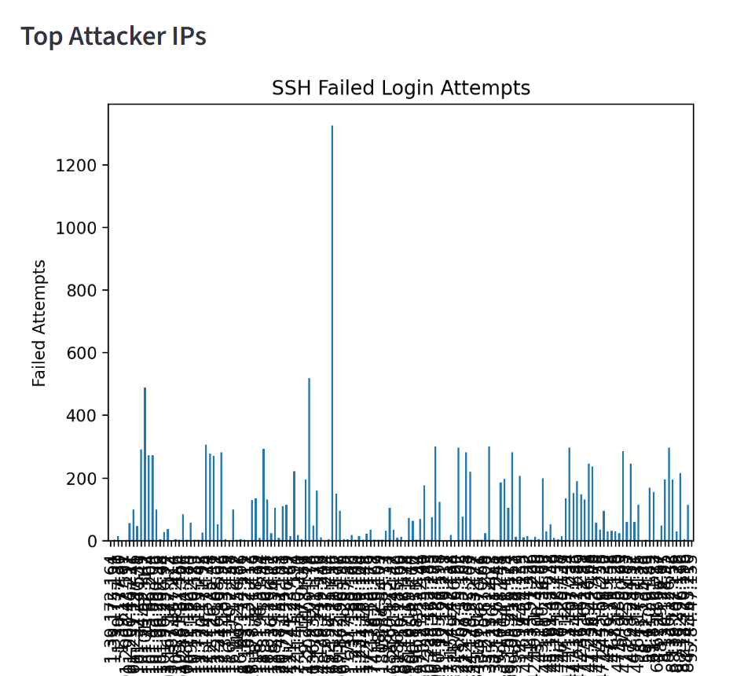
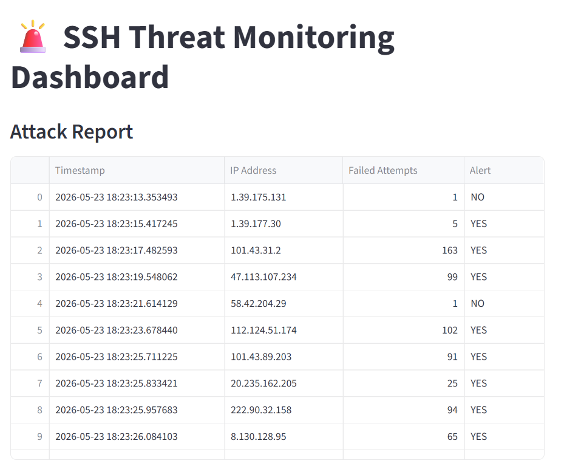

# AWS-Based SOC Monitoring & SIEM Threat Detection Platform

## Overview

This project is a Security Operations Center (SOC) Home Lab designed to simulate real-world security monitoring, threat detection, and incident investigation workflows. 

The environment consists of an AWS-hosted Ubuntu server acting as a monitored asset, Kali Linux as the attack machine, and Splunk Enterprise as the Security Information and Event Management (SIEM) platform.

The solution collects and analyzes SSH authentication logs, detects reconnaissance and unauthorized access attempts, identifies attacker IP addresses, and provides SOC-style dashboards for monitoring security events in real time.

---

## Architecture

Kali Linux (Attacker)
↓
AWS EC2 Ubuntu Server
↓
Linux Authentication Logs (auth.log)
↓
Splunk Enterprise SIEM
↓
Dashboards, Detection Rules, Investigation

---

## Key Features

### Security Monitoring

* Real-time SSH log monitoring
* Linux authentication log analysis
* Suspicious connection tracking
* Unauthorized access detection

### Threat Detection

* Invalid username detection
* SSH reconnaissance detection
* Connection anomaly detection
* Top attacker IP identification

### SIEM & Threat Hunting

* Splunk Enterprise deployment
* Custom SPL detection queries
* Security event investigation
* Log correlation and analysis

### SOC Dashboard

* Top Attacker IPs
* SSH Attack Timeline
* Top Targeted Usernames
* SSH Scanning Activity
* Recent SSH Attack Events
* Successful vs Failed Access Analysis

### Attack Simulation

* Kali Linux attack platform
* Nmap reconnaissance simulation
* SSH enumeration testing
* Attack-to-detection validation

---

## Technologies Used

* AWS EC2
* Ubuntu Linux
* Splunk Enterprise
* Kali Linux
* Python
* Streamlit
* Pandas
* Matplotlib
* Linux Authentication Logs
* SPL (Search Processing Language)

---

## Project Structure

SSH-Threat-Monitor/

├── main.py

├── parser.py

├── alerts.py

├── dashboard.py

├── requirements.txt

├── README.md

├── logs/

├── reports/

└── screenshots/

---

## SOC Detection Queries

### Top Attacker IPs

```spl
index=* "Invalid user"
| rex "from (?<attacker_ip>\d+\.\d+\.\d+\.\d+)"
| stats count by attacker_ip
| sort - count
```

### SSH Reconnaissance Detection

```spl
index=* "Invalid user"
| rex "from (?<attacker_ip>\d+\.\d+\.\d+\.\d+)"
| stats count by attacker_ip
| where count > 3
```

---

## Screenshots

### SOC Monitoring Dashboard



### SSH Reconnaissance Alert



### Top Attacker IP Analysis


---

## Skills Demonstrated

* Security Operations Center (SOC)
* SIEM Monitoring
* Splunk Administration
* Threat Hunting
* Detection Engineering
* Linux Security Monitoring
* Log Analysis
* Incident Investigation
* AWS Security Monitoring
* Attack Simulation
* Cyber Threat Detection

---
## MITRE ATT&CK Mapping

The attack scenarios and detections implemented in this project align with the following MITRE ATT&CK techniques:

| Technique ID | Technique Name | Description |
|-------------|----------------|-------------|
| T1110 | Brute Force | Repeated SSH authentication attempts against user accounts |
| T1595 | Active Scanning | Reconnaissance and service discovery using Nmap |
| T1078 | Valid Accounts | Attempted use of legitimate account credentials |
| T1046 | Network Service Discovery | Identification of exposed services and ports |

This mapping helps security analysts understand attacker behavior and improves detection engineering capabilities.

## Future Enhancements

* Windows Sysmon Integration
* Splunk Universal Forwarder Deployment
* Email Alerting
* Threat Intelligence Integration
* MITRE ATT&CK Mapping
* Automated Incident Response
* Multi-Host Log Collection

---

## Author

Mahi Honnagol
Cybersecurity | SOC Analyst | Cloud Security Enthusiast
